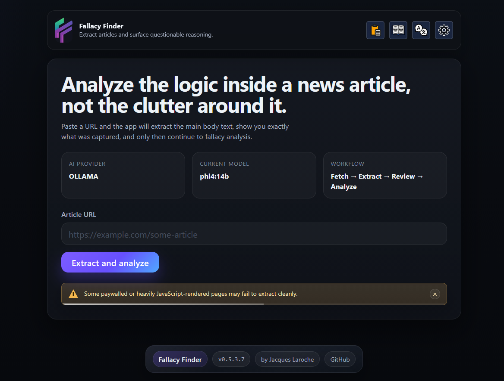
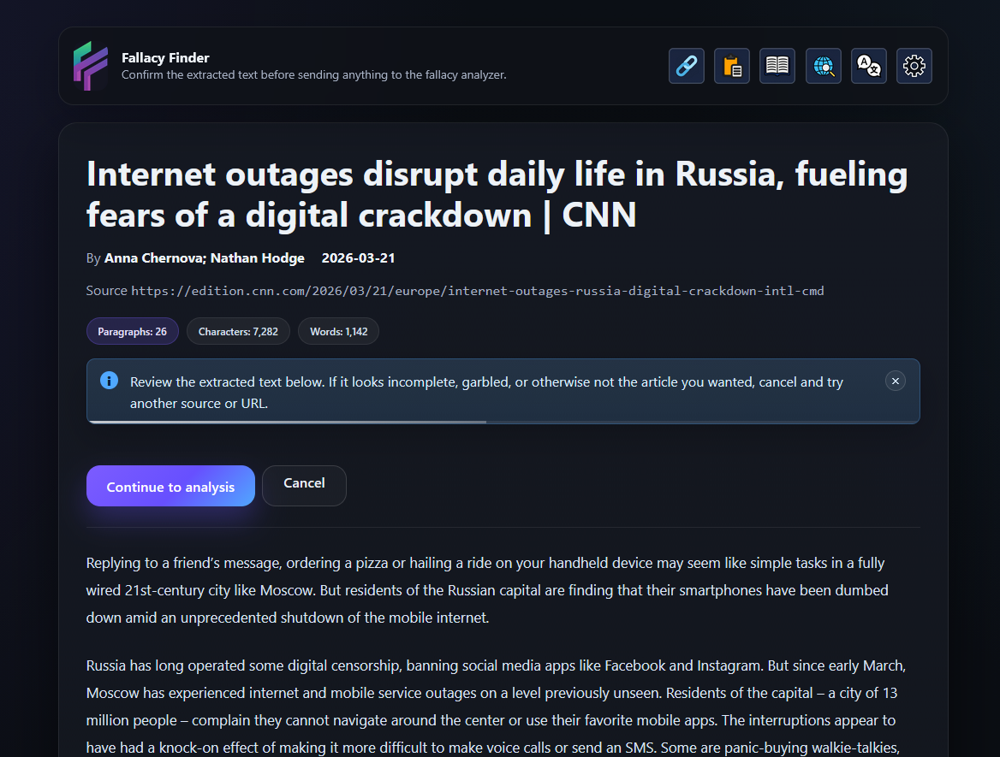
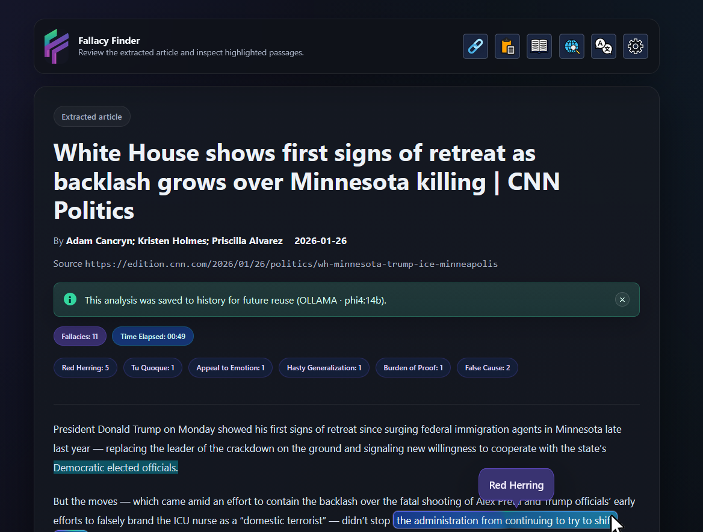
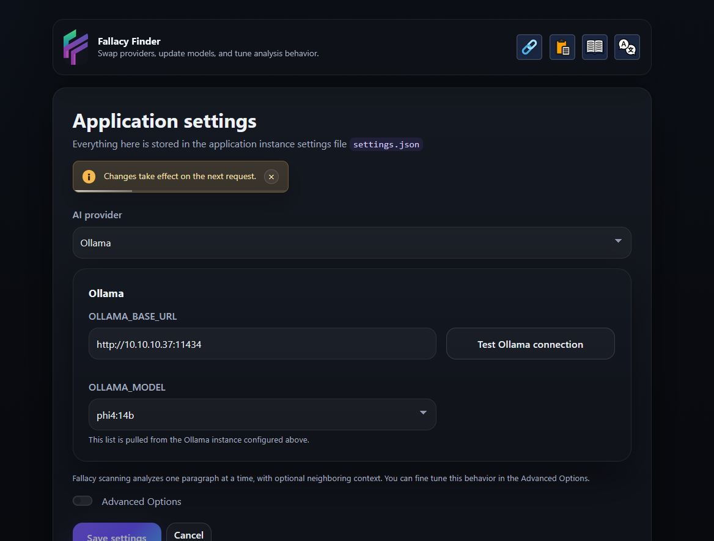
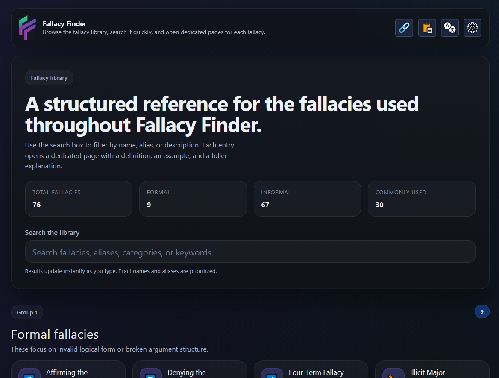
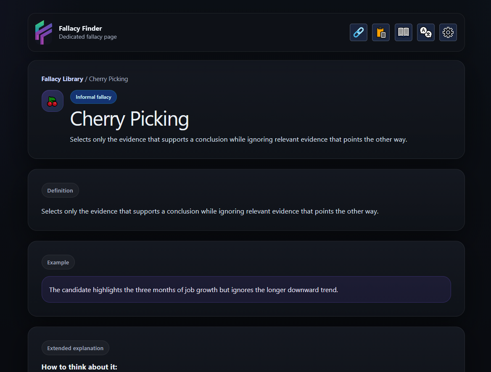

<p align="center">
  
</p>

<h1 align="center">Fallacy Finder</h1>

<p align="center">
  <b>Detect logical fallacies in articles and pasted text.</b> 
  <br>
  Self Hosted • Beautiful Interface • Multilingual
</p>

<p align="center">
  <a href="https://github.com/jlar0che/FallacyFinder/releases"></a>
  <a href="https://hub.docker.com/r/jlaroche/fallacy-finder"></a>
  <a href="https://hub.docker.com/r/jlaroche/brainwave"></a>
  <a href="LICENSE"></a>
  
</p>

<p align="center">
  
</p>

---

## Table of Contents

1. [What is Fallacy Finder?](#what-is-fallacy-finder)
2. [Why Fallacy Finder?](#why-fallacy-finder)
3. [Key Features](#key-features)
4. [Screenshots](#screenshots)
5. [Quickstart with Docker](#quickstart-with-docker)
6. [Configuration](#configuration)
7. [How It Works](#how-it-works)
8. [Roadmap Ideas](#roadmap-ideas)
9. [Contributing](#contributing)
10. [License](#license)

---

## What is Fallacy Finder?

**Fallacy Finder** is a self-hosted web application for analyzing arguments and surfacing potential logical fallacies in a readable, visual way.

Paste in text or submit a URL, let the app extract and review the content, and then run it through a language model to identify possible fallacious reasoning. Results are displayed with highlighted passages, counters, expandable explanations, and a built-in library of fallacy definitions.

Fallacy Finder is designed for people who want something more useful than a generic chatbot answer. The project was made for students, educators and inquisitive minds. 

---

## Why Fallacy Finder?

Most commercial LLMs can identify a fallacy if you ask properly. Very few are built to make the process **usable, reviewable, and repeatable**.

Fallacy Finder focuses on:

- **A better workflow** <br>
Inspect extracted text before analysis begins
- **A better reading experience**<br> Highlighted passages, badges, and structured result views
- **A better reference experience**<br> Built-in fallacy library with detailed explanations
- **Flexible deployment**<br>
Use local models via Ollama or cloud models via OpenAI
- **Accessibility for real users**<br> Multilingual interface and polished UI 

---

## Key Features

### Analysis
- Analyze **web articles by URL**
- Analyze **custom pasted text**
- Review extracted content before spending tokens or compute
- Highlight passages that contain likely fallacies
- Show fallacy counts, metadata, and result summaries
- Optionally include **reasoning/explanations** for each detected finding

### Model Support
- **Ollama** support for local/self-hosted models
- **OpenAI** support for hosted models
- Model-aware saved results and settings workflows
- Provider connection testing from the UI

### Reference & Learning
- Built-in Fallacy Library
- Individual fallacy detail pages
- Related fallacies and classification metadata
- Useful for critical reading, teaching, and rhetorical analysis

### UX
- Dark, modern interface
- Multilingual UI
- Responsive layout
- Review step between extraction and analysis
- Clear alerts and settings flow

---

## Screenshots

<p align="center">
  
  
</p>
<p align="center">
  
  
</p>
<p align="center">
  
  
</p>


---

## Quickstart with Docker

### docker-compose.yml

```yaml
services:
  fallacyfinder:
    image: jlaroche/fallacyfinder:latest
    container_name: fallacyfinder
    ports:
      - "8784:8080"
    environment:
      - SECRET_KEY=change-me-to-a-long-random-string
      - OLLAMA_BASE_URL=http://localhost:11434
      - OLLAMA_MODEL=phi4:14b
      # Optional OpenAI support
      - OPENAI_API_KEY=
    volumes:
      - ./instance:/app/instance
      - ./logs:/app/logs
    restart: unless-stopped
```

### Run it

```bash
docker compose up -d
```

Then open:

```text
http://YOUR-SERVER-IP:8784
```

---

## Configuration

Fallacy Finder is designed to work well in self-hosted environments. Whjle we encourage experimentation with different models, after extensive testing we recommend using <a href="https://ollama.com/library/phi4"> Microsoft's Phi-4 (14b) model </a> with Fallacy Finder. 

**Common Configuration Options:**

- `SECRET_KEY` — Flask session secret (can be generated <a href="https://it-tools.tech/token-generator">here</a>)
- `OPENAI_API_KEY` — optional, only needed if using OpenAI

**Extended Configuration Options** <br>
Options for HTTPS and Reverse Proxy support can be found in the .env.example file.

You can also expose and tune additional settings from within Fallacy Finder's UI.

---

## How It Works

1. **Submit a URL or paste text**
2. **Review extracted content** before analysis
3. **Send the text to the configured LLM provider**
4. **Parse structured fallacy results**
5. **Display findings visually** with highlights, metadata, and fallacy details

The goal is not to claim perfect philosophical certainty.
The goal is to make argument analysis more transparent, inspectable, and practically useful.

---

## Who It’s For

Fallacy Finder is especially useful for:

- students learning argumentation and rhetoric
- teachers building classroom examples
- researchers working with discourse and persuasion
- journalists and readers evaluating public claims
- anyone who wants a practical tool for spotting questionable reasoning

---

## Roadmap Ideas

- more base fallacies
- export/share analysis results
- compare outputs across multiple models
- increase multilingual support
- improved source extraction for difficult websites
- user accounts and saved analysis history improvements

---

## Contributing

Contributions are welcome!

Especially useful contributions include:

- UI and accessibility improvements
- translation improvements
- extraction improvements for tricky websites
- model prompt and parsing improvements
- documentation and test coverage

If you open an issue or PR, thank you — seriously.

---

## License

Distributed under the **GPL-3.0** license. See `LICENSE` for more information.

---

## Credits

Built with 💞 by <a href="https://www.linkedin.com/in/jacqueslaroche">**Jacques Laroche**</a> as a Project for the <a href="https://digitalcuriosity.center">**Center for Digital Curiosity**</a> - a multidisciplinary, student-focused labority built and operated in the heart Belgrade, Serbia.